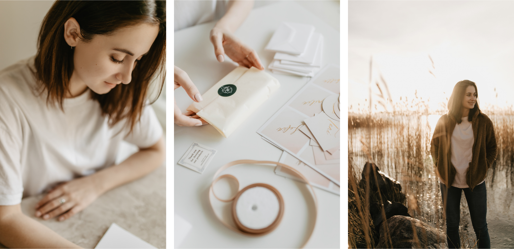

+++
title = "Minusta"
+++

  

Nimeni on Irina, olen Suomessa toimiva akvarelli- ja viivapiirtäjä. Alun perin olen Venäjältä, ja tulin Suomeen suorittamaan maisterin tutkintoa. Opiskeluaikana päädyin piirtämään kukkia ja luomaan kauniita paperitarvikkeita kuvituksillani.

Suunnittelen <b>paperitarvikkeita häihin, postikortteja ja onnittelukortteja, logoja, käyntikortteja ja brändäysmateriaaleja</b>. Ja kaikkia muita tuotteita, joihin voi käyttää kukka- ja kasvikuvituksia.

<h4>Tarjoan kolmenlaisia tuotteita</h4>

<ul>
  <li>valmiit mallit</li>
  <li>yksilölliset mallit</li>
  <li>vahasinetit ja kirkekuoret <a href="http://shop.crocuspaperi.com/">verkkokaupassa</a></li>
</ul>

Klikkaa <a href="https://www.crocuspaperi.com/fi/pricing">hinnasto</a> saadaksesi lisätietoja.

<h4>Appeared in</h4>
<ul>
<li><a href="https://meidanhaat.fi/ajankohtaista/haakattaus-2018-kolme-nayttavaa-ja-trendikasta-tyylia/">Hääkattaus 2018 – kolme näyttävää ja trendikästä tyyliä, MEIDÄN HÄÄT</a></li>
<li><a href="https://www.haatjajuhlat.fi/suunnitelkaa-juhlanne-haaplannerilla/">Suummitelkaa juhlanne hääplanerilla, HÄÄT JÄ JUHLAT</a></li>
<li><a href="https://www.haat.fi/artikkeli/inspiraatiota-satumetsan-lumosta-haihin">Ideoita pastellisiin prinsessahäihin, HÄÄT</a></li>
<li><a href="https://www.haat.fi/artikkeli/ideoita-pastellisiin-prinsessahaihin">Inspiraatiota satumetsän lumosta häihin, HÄÄT</a></li>
<li><a href="https://www.haat.fi/artikkeli/annin-haiden-pienet-yksityiskohdat-kokonaisuus-alkaa-niista">Annin häiden pienet yksityiskohdat – kokonaisuus alkaa niistä, HÄÄT</a></li>
<li><a href="https://www.haat.fi/artikkeli/rantateema-ota-talteen-upeat-ideat">Rantateema: Ota talteen upeat ideat!, HÄÄT</a></li>
</ul>

<h4>FAQ</h4>

<b>Kauanko hääpaperituotteiden suunnittelu ja valmistelu kestää?</b>

<u>Valmiit mallit:</u> suunnittelu, kommenttejanne ja vastaavia muokkauksia – enintään 1 viikko + 2 viikkoa tulostukseen.
  <u>Yksilöllinen (täysin uusi design uudenlaisilla piirustuksilla):</u> suunnittelu, asiakkaan kommentteja ja vastaavia muokkauksia – enintään 2,5 viikkoa + 2 viikkoa tulostukseen.
  Sesonkiaikana (huhtikuu - elokuu) nämä aikataulut saattavat olla pidempiä <u>Foliointi</u> voi kestää jopa 3 viikkoa.
  Valmistusaika ei valitettavasti riipu vain minusta - teen yhteistyötä ja tilaan tulostusta eri painotaloista.

<b>Onko mahdollista saada designit / tulosteet nopeammin?</b>

Kyllä se on! Jos lähetätte minulle valmiit tekstit hyvin etukäteen, muokkaukset ja korjaukset vaativat vähemmän aikaa.
  Muuten, mitä nopeammin annatte minulle palautetta designeista, sitä nopeammin lähetämme tuotteet tulostukseen.
  On myös mahdollista tilata pikatulostusta. Kiireellisissä tulostuksissa tulee 40 %:lla korotettu hinta.

<b>Haluaisimme tilata kutsuja, menu-kortteja sekä istumajärjestys kortteja, mutta meillä ei vielä ole ruokalistan tietoa eikä valmista vieraiden listaa. Onko mahdollista tilata nämä tuotteet myöhemmin?</b>

Kyllä se on mahdollista! Normaalisti teen työtä vaiheittain: ensin teemme kutsukortteja,
  ja muut tuotteet tarvittaessa valmistellaan lähempänä hääpäivää. Muistakaa kuitenkin että tulostus kestää 2 viikkoa.

<b>Mikäli tilaan valmiista malleista, onko mahdollista siihen tehdä muutoksia?</b>

Kyllä voi! Hinta pysyy samana, jos haluatte lisätä/muokata jotain myös valmiiseen malliin.
Lopulliseen hintaan sisältyy jo kaikki tarvitsemanne muutokset, koska uskon, että se on tärkeä tehdä jokaisen designin
erityiseksi fonttien ja asettelun muokkaamalla.

<b>Tulostatko aina samalle paperille?</b>

Ei, minulta on saatavilla erilaisia papereita ja aina etsin uusia malleja. Kyllä se ei ole helppoa valita paperia
  katsomalla kuvia, joten aina tarjoan lähettää ilmaisia paperinäytteitä postitse. Voit tilata näytteitä lähettämällä
  minulle viestiä tai sähköpostia. Mikäli haluaisit tavata ja keskustella designista henkilökohtaisesti, voin tuoda
  paperinäytteet tapaamiselle.

<b>Teetkö logoja ja brändäystä?</b>

Kyllä suunnittelen myös logoja ja brändäystä yrityksille (lisätietoja ja hinnat löytyy <a href="https://www.dropbox.com/s/x3uqqhlgtime6cl/logo_pricing_hinnasto.pdf?dl=0">täältä</a>).
  Pystyn tarjoamaan räätälöityjen logojen suunnittelua sekä valmiita malleja/piirustuksia, joista voimme tehdä logoja.
  Tekijänoikeussyistä en voi mainosta logoja verkkosivullani, koska haluan pitää kaikki designit erityisinä jokaiselle
  asiakkaalle. Pyytäessänne lähetän teille linkin kokoelmaani.

<b>Osaatko suomea?</b>

Osaan kirjoittaa suomeksi, ja useimmissa tapauksissa yritän vastata sähköpostiisi suomeksi. Käytän englantia, jos minulla on kova kiire tai jos asiaa pitää hoitaa lyhyellä aikataululla. Minulla on myös apuhenkilö, joka joskus auttaa minua kirjoittaa sähköpostia suomen kielellä.

Mitä tulee puhumiseen, osaan puhua jokapäiväisissä tilanteissa, mutta valitettavasti en vielä uskalla keskustella töitäni hyvällä suomen kielellä.😉 

